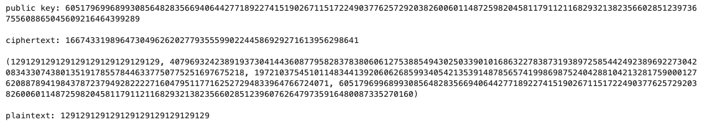

# Rabin
This project implements the Rabin Cryptosystem in SageMath, a public-key encryption algorithm based on the integer factorization problem. The system uses blum primes for p and q to simplify the decryption process.

# Introduction
This implementation of rabin uses the sagemath libraries inverse_mod, is_blum_prime, and random_prime so you need
sagemath for this implementation to work properly. The code is in Jupyter Notebook format for simplicity.

# Installation
To install the tool, clone the repository and download the notebook file. You can run the notebook file in a Jupyter Notebook environment.

# Expected output

